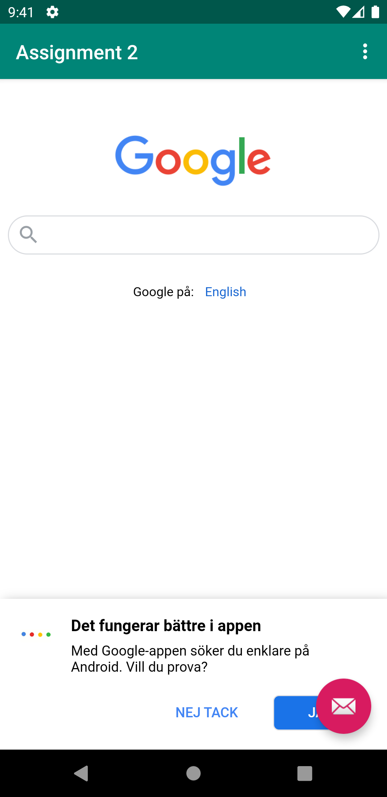
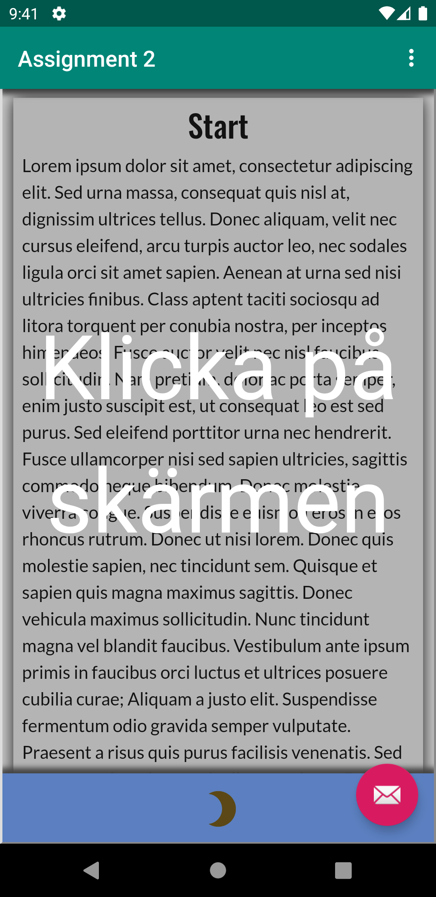

# Rapport

För att ändra namnet på appaen ändrades string elementet med attributet app_name i strings.xml.
```
<resources>
    <string name="app_name">Assignment 2</string>
    <string name="action_external_web">External Web Page</string>
    <string name="action_internal_web">Internal Web Page</string>
</resources>
```
Sedan för att låta appen gå ut på nätet användes koden nedan i AndroidManifest för att ge tillåtelse.
```
    <uses-permission android:name="android.permission.INTERNET" />
```
efter det skapades ett webview element i content_main.xml med my_webview som id och lite kod som bestämmer positionering och storlek på elementet.
```
    <WebView
        android:id="@+id/my_webview"
        android:layout_width="match_parent"
        android:layout_height="match_parent"
        android:layout_marginTop="50dp"
        app:layout_constraintBottom_toBottomOf="parent"
        app:layout_constraintEnd_toEndOf="parent"
        app:layout_constraintStart_toStartOf="parent"
        app:layout_constraintTop_toTopOf="parent"/>
```
resterande delar utförs i MainActivity.java där det först deklareras en privat medlems variabel av typen WebView med namnet myWebView i klassen MainActivity vilket gör att klassen WebView behöver importeras.
```
import android.webkit.WebView;
    private WebView myWebView;
```
sen tilldelades myWebView värdet av id:et my_webview med hjälp av findbywebview i oncreate
```
        myWebView = findViewById(R.id.my_webview);
```
raden efter skapades en ny webviewclient för mywebview och WebViewClient importerades utanför MainActivity. 
```
import android.webkit.WebViewClient;
        myWebView.setWebViewClient(new WebViewClient());
```
sedan i oncreate gjordes det möjligt att exekvera javascript genom att för myWebView få inställningarna och setJavaScriptEnabled till sant.
```
        myWebView.getSettings().setJavaScriptEnabled(true);
```
efter det skapades en asset folder med en mapp för bilder och en html fil.
sedan användes funktionen loadUrl för att hämta den interna hemsidan för myWebView i funkionen showInternalWebPage och en extern hemsida i showExternalWebPage.
```
    public void showExternalWebPage(){
        // TODO: Add your code for showing external web page here
        myWebView.loadUrl("https://www.google.com/");

    }

    public void showInternalWebPage(){
        // TODO: Add your code for showing internal web page here
        myWebView.loadUrl("file:///android_asset/Example.html");
    }
```
sist callades de funktionerna beroende på vad som klickas i onOptionsItemSelected
```
    public boolean onOptionsItemSelected(MenuItem item) {
        // Handle action bar item clicks here. The action bar will
        // automatically handle clicks on the Home/Up button, so long
        // as you specify a parent activity in AndroidManifest.xml.
        int id = item.getItemId();

        //noinspection SimplifiableIfStatement
        if (id == R.id.action_external_web) {
            showExternalWebPage();
            Log.d("==>","Will display external web page");
            return true;
        }

        if (id == R.id.action_internal_web) {
            showInternalWebPage();
            Log.d("==>","Will display internal web page");
            return true;
        }

        return super.onOptionsItemSelected(item);
    }
```



